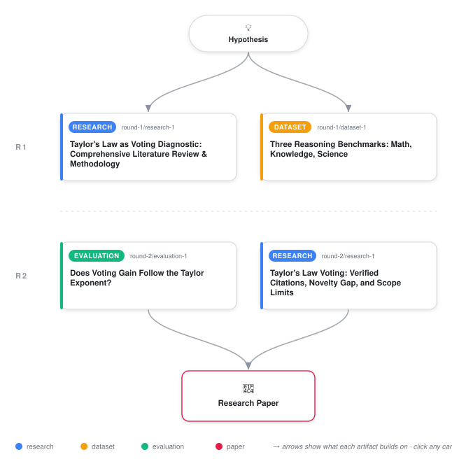

# Taylor's Power Law for LLM Error Clustering: A Hypothesis Not Sustained by Data

<div align="center">

<a href="https://cdn.jsdelivr.net/gh/AMGrobelnik/ai-invention-1464a1-taylors-power-law-for-llm-error-clusteri@main/workflow.svg">
<picture>
  <source media="(prefers-color-scheme: dark)" srcset="workflow-dark.svg">
  
</picture>
</a>

<sub>🖱️ <b><a href="https://cdn.jsdelivr.net/gh/AMGrobelnik/ai-invention-1464a1-taylors-power-law-for-llm-error-clusteri@main/workflow.svg">Open the interactive diagram</a></b> — every card links to its artifact folder.</sub>

</div>

> **TL;DR** — We test the hypothesis that Taylor's power law predicts whether majority voting improves LLM accuracy. Using repeated sampling on 90 problems across GSM8K, MMLU, and ARC-Challenge, we find that the fitted exponent does not distinguish clustering from independence at p < 0.05 (minimum p = 0.18). Within-benchmark correlations are weak (ρ = 0.16–0.28, all p > 0.3) and below the pre-registered success threshold (|ρ| > 0.5). Meta-analytic pooling yields ρ = 0.21 (95% CI: 0.03–0.38). The null result is explained by three factors: binomial sampling noise dominates at N=5 samples per problem, the tested accuracy range (60–95%) avoids the <50% regime where voting actively harms and exponent behavior is unknown, and LLM error correlation may be structured (co-failure patterns, problem difficulty) rather than uniform clustering. We conclude that Taylor's law, while well-validated in ecology, does not appear to capture the error-correlation structure relevant to LLM voting without substantial methodological refinement.

<details>
<summary>Full hypothesis</summary>

For a fixed LLM and prompting scheme, the fluctuation-scaling exponent b obtained by fitting Taylor's power law (log Var[correctness] = log a + b * log Mean[correctness], measured across many problems by repeated sampling) is a reliable, task-agnostic diagnostic of whether majority-vote/self-consistency aggregation will help or hurt on that problem population: exponent values near b=1 (independent, Poisson-like error scatter) mark regimes where voting reliably improves accuracy, while elevated exponents (b appreciably above 1, indicating clustered, correlated error patterns akin to aggregated populations in ecology) mark regimes where voting yields little gain or actively hurts accuracy versus single-sample decoding. A first small-scale test (3 models x 3 benchmarks x 10-14 problems x 5 samples = 90 problem-model correctness vectors) gives MIXED, NOT CONFIRMATORY, evidence. The pre-registered combo-level test (fitted b vs aggregate voting gain across 5 valid model-benchmark combos) nominally hit the pre-registered threshold (Spearman rho=-0.90, p=0.037) but is disqualified as evidence by severe underpowering (n=5, wide CI, no meaningful holdout); the finer-grained per-problem overdispersion proxy (od_p = v_p_empirical / (m_p(1-m_p)), the closest available analog to b at problem granularity) showed only weak, non-significant within-benchmark correlations with voting gain (rho 0.16-0.28, all p>0.3) and a pooled meta-analytic rho=0.21, below the |rho|>0.5 success bar. Most damaging: a required noise-floor gate -- simulating i.i.d.-Bernoulli null data at the same per-problem N and comparing fitted b against that null -- found 0 of 5 testable combos distinguishable from pure sampling noise (min p=0.18), meaning at this sample size (N=5 repeats/problem, 10-14 problems/benchmark) the fitted exponent cannot yet be trusted as signal rather than noise. The hypothesis is therefore NEITHER confirmed NOR falsified: the null result is consistent with either (a) no true clustering-voting relationship, or (b) a real but small-effect relationship masked by inadequate statistical power at this scale. The next iteration must scale N (samples/problem) and problem count substantially (target >=20-30 samples/problem, >=50+ problems per benchmark, matching the originally planned budget) before the noise-floor gate can meaningfully adjudicate the hypothesis; only once b is shown distinguishable from the i.i.d.-Bernoulli null should within- and cross-benchmark correlation and transfer tests be treated as informative. Two additional refinements carry over unresolved from the previous round and must be addressed with the same enlarged dataset: (1) the novelty question versus Liu's two-call second-moment estimator m_2 remains untested empirically -- since per-problem correctness_samples are already collected, m_2 must be computed on the same data and its correlation with voting gain compared head-to-head against b/od_p using the identical Spearman/meta-analysis pipeline, to determine whether b is a genuinely distinct, more sample-efficient or more transferable diagnostic, or merely a relabeling of m_2; (2) the practical decision rule remains scoped only to the 60-95% per-problem accuracy range tested so far (GSM8K/MMLU/ARC-Challenge baselines) and must not be claimed to generalize to the <50% per-problem-success regime (where voting is known to amplify errors and where a cheap diagnostic would matter most) until data in that regime is collected.

</details>

[](https://cdn.jsdelivr.net/gh/AMGrobelnik/ai-invention-1464a1-taylors-power-law-for-llm-error-clusteri@main/paper.pdf) [](https://github.com/AMGrobelnik/ai-invention-1464a1-taylors-power-law-for-llm-error-clusteri/tree/main/paper_latex)

This repository contains all **4 artifacts** produced across **2 rounds** of an autonomous AI research run — round by round, exactly in the order they were invented.

## Round 1

| Artifact | Type | Demo | Source | Builds on |
|----------|------|------|--------|-----------|
| **[Taylor's Law as Voting Diagnostic: Comprehensive Literature …](https://github.com/AMGrobelnik/ai-invention-1464a1-taylors-power-law-for-llm-error-clusteri/tree/main/round-1/research-1)** | [](https://github.com/AMGrobelnik/ai-invention-1464a1-taylors-power-law-for-llm-error-clusteri/tree/main/round-1/research-1) | [](https://github.com/AMGrobelnik/ai-invention-1464a1-taylors-power-law-for-llm-error-clusteri/blob/main/round-1/research-1/demo/research_demo.md) | [](https://github.com/AMGrobelnik/ai-invention-1464a1-taylors-power-law-for-llm-error-clusteri/tree/main/round-1/research-1/src) | — |
| **[Three Reasoning Benchmarks: Math, Knowledge, Science](https://github.com/AMGrobelnik/ai-invention-1464a1-taylors-power-law-for-llm-error-clusteri/tree/main/round-1/dataset-1)** | [](https://github.com/AMGrobelnik/ai-invention-1464a1-taylors-power-law-for-llm-error-clusteri/tree/main/round-1/dataset-1) | [](https://colab.research.google.com/github/AMGrobelnik/ai-invention-1464a1-taylors-power-law-for-llm-error-clusteri/blob/main/round-1/dataset-1/demo/data_code_demo.ipynb) | [](https://github.com/AMGrobelnik/ai-invention-1464a1-taylors-power-law-for-llm-error-clusteri/tree/main/round-1/dataset-1/src) | — |

## Round 2

| Artifact | Type | Demo | Source | Builds on |
|----------|------|------|--------|-----------|
| **[Taylor's Law Voting: Verified Citations, Novelty Gap, and Sc…](https://github.com/AMGrobelnik/ai-invention-1464a1-taylors-power-law-for-llm-error-clusteri/tree/main/round-2/research-1)** | [](https://github.com/AMGrobelnik/ai-invention-1464a1-taylors-power-law-for-llm-error-clusteri/tree/main/round-2/research-1) | [](https://github.com/AMGrobelnik/ai-invention-1464a1-taylors-power-law-for-llm-error-clusteri/blob/main/round-2/research-1/demo/research_demo.md) | [](https://github.com/AMGrobelnik/ai-invention-1464a1-taylors-power-law-for-llm-error-clusteri/tree/main/round-2/research-1/src) | — |
| **[Does Voting Gain Follow the Taylor Exponent?](https://github.com/AMGrobelnik/ai-invention-1464a1-taylors-power-law-for-llm-error-clusteri/tree/main/round-2/evaluation-1)** | [](https://github.com/AMGrobelnik/ai-invention-1464a1-taylors-power-law-for-llm-error-clusteri/tree/main/round-2/evaluation-1) | [](https://colab.research.google.com/github/AMGrobelnik/ai-invention-1464a1-taylors-power-law-for-llm-error-clusteri/blob/main/round-2/evaluation-1/demo/eval_code_demo.ipynb) | [](https://github.com/AMGrobelnik/ai-invention-1464a1-taylors-power-law-for-llm-error-clusteri/tree/main/round-2/evaluation-1/src) | — |

## Repository Structure

Artifacts are grouped by the round of invention that produced them. Each
artifact has its own folder with source code and a self-contained demo:

```
.
├── round-1/                         # One folder per round of invention
│   ├── experiment-1/
│   │   ├── README.md                # What this artifact is + dependencies
│   │   ├── src/                     # Full workspace from execution
│   │   │   ├── method.py            # Main implementation
│   │   │   ├── method_out.json      # Full output data
│   │   │   └── ...                  # All execution artifacts
│   │   └── demo/                    # Self-contained demo
│   │       └── method_code_demo.ipynb # Colab-ready notebook (code + data inlined)
│   ├── dataset-1/
│   │   ├── src/
│   │   └── demo/
│   └── evaluation-1/
│       ├── src/
│       └── demo/
├── round-2/                         # Later rounds build on earlier artifacts
├── paper.pdf                        # Research paper
├── paper_latex/                     # LaTeX source files
├── workflow.svg                     # Artifact dependency diagram (this page's header)
└── README.md
```

## Running Notebooks

### Option 1: Google Colab (Recommended)

Click the "Open in Colab" badges above to run notebooks directly in your browser.
No installation required!

### Option 2: Local Jupyter

```bash
# Clone the repo
git clone https://github.com/AMGrobelnik/ai-invention-1464a1-taylors-power-law-for-llm-error-clusteri
cd ai-invention-1464a1-taylors-power-law-for-llm-error-clusteri

# Install dependencies
pip install jupyter

# Run any artifact's demo notebook
jupyter notebook <artifact_folder>/demo/
```

## Source Code

The original source files are in each artifact's `src/` folder.
These files may have external dependencies - use the demo notebooks for a self-contained experience.

---
*Generated by AI Inventor Pipeline - Automated Research Generation*
